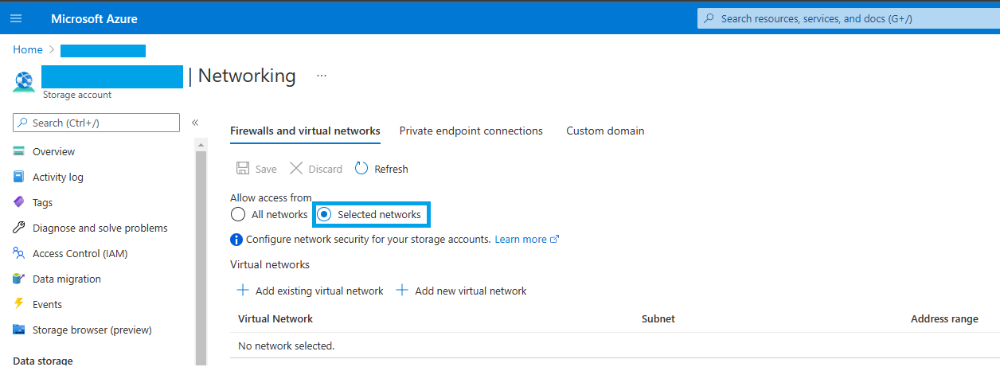

# Storage Firewall

Storage Firewall is available for Storage Accounts in order to limit the public IP addresses that have access to the information stored. Here is more information on how it works: https://docs.microsoft.com/en-us/azure/storage/common/storage-network-security?tabs=azure-portal

The two policies here are intended to simplify the implementation of the Storage Firewall. Here is a summary of their funtionallity:

 -  MandatoryFirewall.json: Creates a policy that does not allow to create public storage accounts. The storage account firewall needs to be enabled since the moment of the creation and cannot be turned off once the account exists

 
 -  AllowSingleIP.json: Receives a parameter that will be either a single IP or an address range and it will be added to the whitelist of the Firewall. You will not be able to remove the IP selected from the firewall, it will be enforced with the policy. You will be able to add additional IPs in case they are needed individually.

Take into account that this policy adds only 1 IP at a time. For adding multiple IPs continue reading on the Policy section of this document.

 
 

