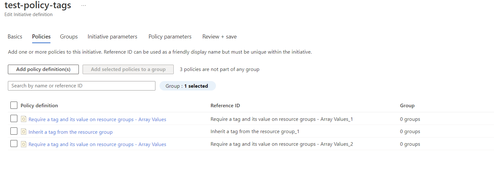

### How to use this policy

1.	Create an Initiative definition that includes two of the _PolicyTagWithSpecifiedValues.json_ policies and the _Inherit from Resource Group_ one. One of the policies will account for “Environment” and the other for “Owner”:

 

2.	Create the Initiative Parameter for both “Environment” and “Owner” with the allowed values that you want. Notice “Type” is “Array”. Here is an example of the format:

 

3.	On the Policy Parameters section, uncheck the Boc “Only show parameters that need input or review” and add your Environment and Owner tags. For its values, you select the initiative parameters created on step 3.
 
  
 
4.	Assign and test!

NOTE: I noticed values are not case sensitive! So “dev” is the same as “Dev” and both are valid entries
